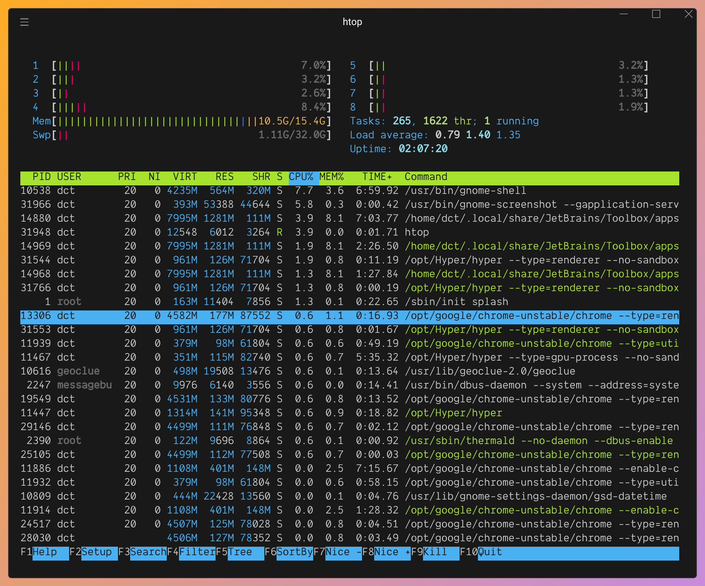

# Hyper Hiberbee
> Hiberbee's color scheme brought to [hyper](https://hyper.is).



## Installation
* `git clone https://github.com/dct2012/hyper-hiberbee .hyper_plugins/local/hyper-hiberbee`
* Insert `hyper-hiberbee` into your `.hyper.js` config
```javascript
  localPlugins: [
    'hyper-hiberbee'
  ]
```

## Resources and inspiration
* [hiberbee](https://github.com/Hiberbee/code-highlight-themes)
